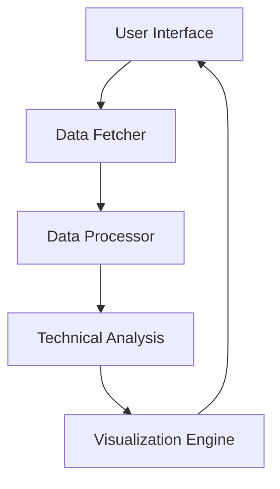

# Stock Analysis Dashboard - Technical Documentation

## Table of Contents
1. [System Architecture](#system-architecture)
2. [Core Components](#core-components)
3. [Technical Features](#technical-features)
4. [Data Flow](#data-flow)
5. [API Reference](#api-reference)
6. [Security](#security)
7. [Performance Optimization](#performance-optimization)
8. [Testing](#testing)
9. [Deployment](#deployment)
10. [Maintenance](#maintenance)

## System Architecture

### High-Level Overview
```
[User Interface (Streamlit)]
         ↓
[Data Processing Layer]
         ↓
[Technical Analysis Engine]
         ↓
[Data Sources (yfinance)]
```

### Component Interaction


## Core Components

### 1. Data Fetcher
```python
def load_stock_data(symbol: str, start: datetime, end: datetime) -> pd.DataFrame:
    """
    Fetches stock data from Yahoo Finance.
    
    Args:
        symbol (str): Stock ticker symbol
        start (datetime): Start date
        end (datetime): End date
        
    Returns:
        pd.DataFrame: Historical price data
    """
    try:
        df = yf.download(
            tickers=symbol,
            start=start,
            end=end,
            progress=False
        )
        return df
    except Exception as e:
        logging.error(f"Error fetching data: {e}")
        return None
```

### 2. Technical Indicators

#### Moving Averages
```python
def calculate_ema(data: pd.DataFrame, period: int) -> pd.Series:
    """
    Calculates Exponential Moving Average.
    
    Args:
        data (pd.DataFrame): Price data
        period (int): EMA period
        
    Returns:
        pd.Series: EMA values
    """
    return data['Close'].ewm(span=period, adjust=False).mean()
```

#### MACD
```python
def calculate_macd(data: pd.DataFrame) -> tuple:
    """
    Calculates MACD indicator.
    
    Returns:
        tuple: (MACD line, Signal line, Histogram)
    """
    exp1 = data['Close'].ewm(span=12, adjust=False).mean()
    exp2 = data['Close'].ewm(span=26, adjust=False).mean()
    macd = exp1 - exp2
    signal = macd.ewm(span=9, adjust=False).mean()
    return macd, signal, macd - signal
```

## Technical Features

### 1. Data Processing Pipeline
```python
class DataPipeline:
    def __init__(self):
        self.cache = {}
        
    def process_data(self, df: pd.DataFrame) -> pd.DataFrame:
        """
        Main data processing pipeline.
        
        Steps:
        1. Clean data
        2. Calculate indicators
        3. Generate signals
        4. Cache results
        """
        pass
```

### 2. Forecasting System
```python
def sarima_forecast(data: pd.Series, periods: int) -> pd.Series:
    """
    Generates SARIMA forecast.
    
    Args:
        data (pd.Series): Historical price data
        periods (int): Forecast periods
        
    Returns:
        pd.Series: Forecast values
    """
    pass
```

## Data Flow

### 1. Data Input/Output Specifications
```yaml
Input:
  - Stock Symbol: str
  - Date Range: tuple(datetime, datetime)
  - Technical Parameters: dict

Output:
  - Processed Data: pd.DataFrame
  - Technical Indicators: dict
  - Signals: pd.DataFrame
  - Visualizations: plotly.Figure
```

### 2. Cache Management
```python
class CacheManager:
    def __init__(self, expiry: int = 3600):
        self.cache = {}
        self.expiry = expiry
        
    def get_cached_data(self, key: str) -> Any:
        pass
        
    def set_cached_data(self, key: str, data: Any) -> None:
        pass
```

## API Reference

### 1. Public Methods
```python
def get_stock_analysis(
    symbol: str,
    start_date: datetime,
    end_date: datetime,
    indicators: List[str] = None
) -> Dict:
    """
    Main public interface for stock analysis.
    
    Returns:
        Dict containing analysis results
    """
    pass
```

### 2. Configuration Options
```python
CONFIG = {
    'cache_duration': 3600,
    'max_forecast_days': 30,
    'default_indicators': [
        'EMA',
        'MACD',
        'RSI',
        'VWAP'
    ],
    'chart_options': {
        'height': 800,
        'template': 'plotly_white'
    }
}
```

## Security

### 1. Data Validation
```python
def validate_input(symbol: str, start_date: datetime, end_date: datetime) -> bool:
    """
    Validates user input parameters.
    
    Returns:
        bool: True if valid, False otherwise
    """
    pass
```

### 2. Error Handling
```python
class AnalysisError(Exception):
    """Base class for analysis errors"""
    pass

class DataFetchError(AnalysisError):
    """Raised when data fetch fails"""
    pass
```

## Performance Optimization

### 1. Caching Strategy
```python
@st.cache_data(ttl=3600)
def cached_stock_data(symbol: str, start: datetime, end: datetime) -> pd.DataFrame:
    """
    Cached version of stock data fetcher.
    """
    pass
```

### 2. Memory Management
```python
def optimize_dataframe(df: pd.DataFrame) -> pd.DataFrame:
    """
    Optimizes DataFrame memory usage.
    """
    pass
```

## Testing

### 1. Unit Tests
```python
def test_technical_indicators():
    """
    Tests technical indicator calculations.
    """
    pass

def test_data_pipeline():
    """
    Tests data processing pipeline.
    """
    pass
```

### 2. Integration Tests
```python
def test_end_to_end():
    """
    Tests complete analysis workflow.
    """
    pass
```

## Deployment

### 1. Environment Configuration
```bash
# Production settings
export STREAMLIT_SERVER_PORT=8501
export STREAMLIT_SERVER_ADDRESS=0.0.0.0
export DEBUG_MODE=False
```

### 2. Monitoring
```python
def log_performance_metrics():
    """
    Logs application performance metrics.
    """
    pass
```

## Maintenance

### 1. Update Procedures
```bash
# Update dependencies
pip install --upgrade -r requirements.txt

# Clear cache
streamlit cache clear
```

### 2. Backup Procedures
```python
def backup_configuration():
    """
    Backs up application configuration.
    """
    pass
```

## Appendix

### A. Error Codes
```python
ERROR_CODES = {
    'E001': 'Data fetch failed',
    'E002': 'Invalid parameters',
    'E003': 'Calculation error',
    'E004': 'Cache error'
}
```

### B. Performance Benchmarks
```python
BENCHMARKS = {
    'data_load': '< 2s',
    'indicator_calc': '< 1s',
    'visualization': '< 3s'
}
```

### C. Dependencies
```python
REQUIRED_PACKAGES = {
    'streamlit': '>=1.20.0',
    'pandas': '>=1.3.0',
    'plotly': '>=5.10.0',
    'yfinance': '>=0.2.0',
    'numpy': '>=1.20.0',
    'statsmodels': '>=0.13.0'
}
```

This documentation provides a comprehensive technical reference for developers working with the Stock Analysis Dashboard. It should be updated as new features are added or existing ones are modified.
